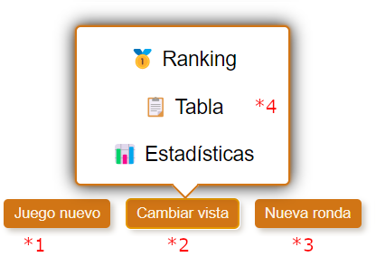

# Bottom controls component

This component shows at the bottom of game views. Allows to start a new game, show different views of the game or enter a new round.

**(\*1)** Navigates to [game config view](./GAME_CONFIG.md) to start a new game (no edition config mode).

**(\*2)** Shows or hides a pop up with links **(\*4)** that allows to navigate to other views of the game.

**(\*3)** Navigates to the view that allows to enter score for all players for a new round.

## Flags

### (*2) bottomControls:changeViews

If active, shows the button that opens a pop up with links that allow to change to different views of the game. Forces to have a property describing the allowed views.

**Properties**:

- **(\*4)** changeViews: { path: RoutingPath; display: string }[]

### (*3) bottomControls:newRound

If active, shows the button that navigates to the view that allows to enter scores for all players for a new round.

**Properties**:

- enterScoreRoute: RoutingPath

### (*3) bottomControls:newRound:state

If active, the service provides state to navigate to enter score view when entering scores for all players for a new round.

**Properties**:

- getStateEnterNewRound(): { [key: string]: any }
