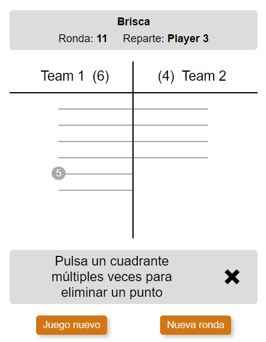

# Brisca view

This view is created for the brisca game. It shows the points of each team or player, depending on the modality.

## Flags

### brisca

Allows to show the view.

**Properties**:

- **(\*1)** modality: 'individual' | 'teams'
- **(\*1)** playerNames: string[]
- **(\*1)** teamNames: string[]
- **(\*2)** scores: number[]
- **(\*3)** setPreviousDealingPlayerIndex: () => void

### game:localStorageSave

Allows to save the state of the game when a point is removed to a team or player.

**Properties**:

- saveStateToLocalStorage(): void

## Functional analysis

On page load it checks if the banner explaining how to delete a point **(\*5)** has to be shown. It is shown each time a game starts or if it has been hidden for more than one day. The cross closes the banner and it is not shown after entering new points.

The time the game lasts **(\*4)** is calculated every second after the page loads, and it is the difference of time since the time started in [game config view](./GAME_CONFIG.md) and now.

When the user clicks the quadrant **(\*3)** of a team or a player five times, a point is deleted for that team or player.

Every five points, a bullet is shown at the end of a the stripe.
