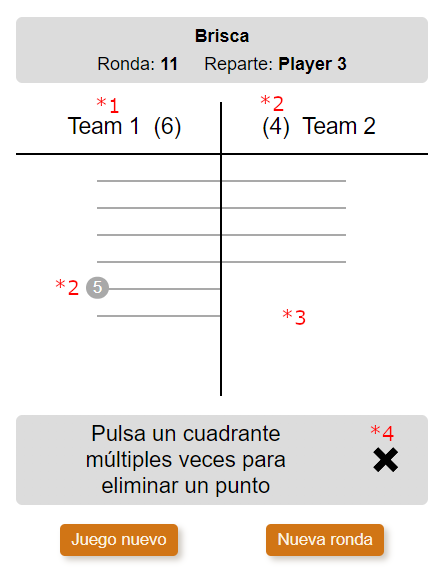

# Brisca view

## Flags

### gameConfig:modality

It is for game config view. Decides which modality is used.

**Properties**:

- modality: 'individual' | 'teams'
- modalityFormControl: FormControl<'individual' | 'teams'>

## In GameService interface

**Properties**:

- saveStateToLocalStorage(): void

## In BriscaService

**Properties**:

- playerNames: string[]

- teamNames: string[]

- scores: number[]

- setPreviousDealingPlayerIndex()
