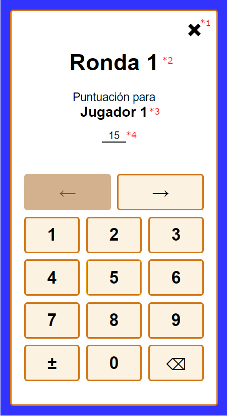

# Enter score view

This view allows to set the score of the players or edit the score of previous rounds.

## Input

The router navigation is used to read the input. These are the **properties**:

- **(\*2)** roundNumber: number

- **(\*3)** playerNames: string[]

- **(\*4)** punctuations: number[]

## Flags

### enterScore

Allows to update the state of the service after confirming the changes.

**Properties**:

- getNextRoundNumber: () => number
- setNextDealingPlayer(): void
- getPlayerId: (playerName: string) => number
- setPlayerScore: (playerId: number, round: number, score: number) => void

### game:localStorageSave

If active, saves the state in the local storage after confirming the changes.

**Properties**:

- saveStateToLocalStorage(): void;

## Functional analysis

When the user presses close button **(\*1)** the user is redirected to the view they came from and nothing is changed.

When confirming the score of the last player, the dealing player index is increased if it was a new round, and optionally the state is also saved in local storage. The time of the last interaction is also updated in the local storage. The user is then redirected to the view they came from.
