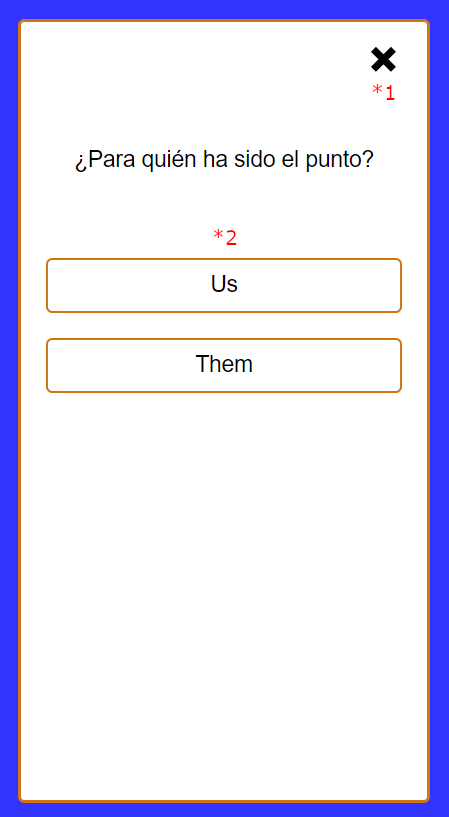

# Enter score brisca view

This view allows you to add a point to a team or a player.

## Flags

### enterScore:brisca

Allows to show the view and add the point.

**Properties**:

- **(\*2)** modality: 'individual' | 'teams'
- **(\*2)** playerNames: string[]
- **(\*2)** teamNames: string[]
- scores: number[]
- setNextDealingPlayer(): void

### game:localStorageSave

If active, saves the state of the game after entering the point.

**Properties**:

- saveStateToLocalStorage(): void

## Functional analysis

If the user presses the cross **(\*1)**, it is redirected back to the view the user came from without applying any change.

If the user clicks a team or player **(\*2)**, it adds the point to that team or player, optionally saves the state in local storage and the redirects the user where they came from.
