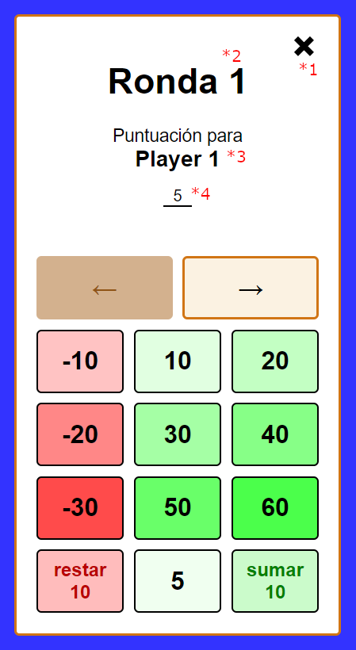

# Enter score pocha view

This view allows to enter or edit the score of the players for pocha game.

## Input

The router navigation is used to read the input. These are the **properties**:

- **(\*2)** roundNumber: number

- **(\*3)** playerNames: string[]

- **(\*4)** punctuations: number[]

## Flags

### enterScore

Allows to update the state of the service after confirming the changes.

**Properties**:

- getNextRoundNumber: () => number
- setNextDealingPlayer(): void
- getPlayerId: (playerName: string) => number
- setPlayerScore: (playerId: number, round: number, score: number) => void

### enterScore:pocha

Necessary to add validation when entering or editing a round for all players.

**Properties**:

- playerNames: string[]

### game:localStorageSave

If active, saves the state in the local storage after confirming the changes.

**Properties**:

- saveStateToLocalStorage(): void

## Functional analysis

For new rounds the score by default appears to 5. If editing a previous round, the score of that round is shown.

When the user presses close button **(\*1)** the user is redirected to the view they came from and nothing is changed.

When confirming the score of the last player, some validation is performed:

- there are no invalid scores (... , -15 , -5 , 0 , 15 , 25 , ...)
- if it is a new round or editing score of all players for a previous round, at least one score is negative

If the validation is not correct, the player with wrong score is shown again to edit it.

If validation is ok, the dealing player index is increased if it was a new round, and optionally the state is also saved in local storage. The time of the last interaction is also updated in the local storage. The user is then redirected to the view they came from.
