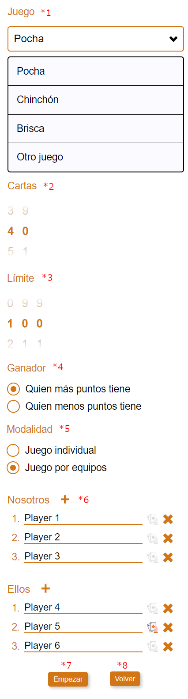

# Game config view

## Flags

### (*2) gameConfig:numberOfCards

Shows a control to select the number of cards.

**Properties**:

- numberOfCards: number
- numberOfCardsFormControl: FormControl&lt;number>

### (*3) gameConfig:limitScore

Shows a control to select the limit score of the game.

**Properties**:

- limitScore: number
- limitScoreFormControl: FormControl&lt;number>
- numberOfScrollers: number

### (*4) gameConfig:winner

Shows a control to select who wins the game.

**Properties**:

- winner: 'highestScore' | 'lowestScore'
- winnerFormControl: FormControl&lt;'highestScore' | 'lowestScore'>

### (*5) gameConfig:modality

Shows a control to select if the game is individual or by teams.

**Properties**:

- modality: 'individual' | 'teams'
- modalityFormControl: FormControl&lt;'individual' | 'teams'>

## In GameService interface

### (*1) Game name

Shows the game name. This question is not shown if it is edition of current game config.

**Properties**:

- gameName: string

### (*6) Player and team names

Allows to enter the names of the teams and the players.

**Properties**:

- teamControls: FormArray&lt;FormControl&lt;EnterPlayerNamesModel>>
- allowEditTeamName: boolean[]

### (*7 and \*8) Start game and edit config

Starts a new game or edits the config of the current game. Only one button is shown.

**Properties**:

- isGameConfigCorrect(): boolean
- onStartGame(): void
- onEditConfigCurrentGame(): void
- saveStateToLocalStorage(): void
- startGameRoute: RoutingPath
- saveStateToLocalStorage(): void

### Others

loadStateFromLocalStorage(): void
