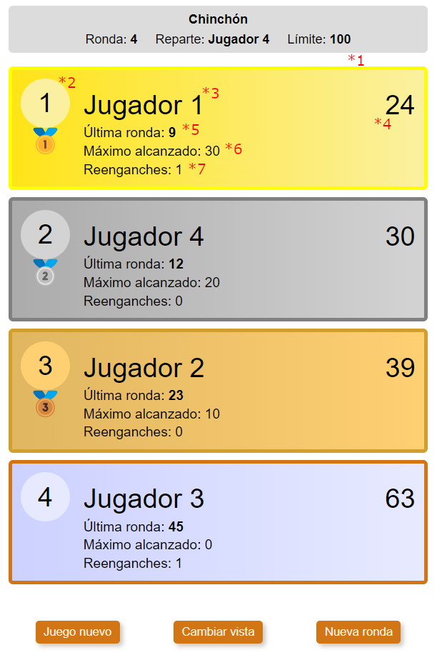

# Ranking view

This component shows the list of players **(\*1)** from first position to last position, with some aditional information.

The player display component, allows to change the score entered **(\*5)** in the last round by clicking on it.

## Flags

### **(\*1)** ranking

Allows to show the players in the correct order.

**Properties**:

- getRankingPlayers(round?: number): number[]

### gameStartEnd

Allows to show a message before the ranking of players can be listed.

**Properties**:

- gameHasStarted: () => boolean

### ranking:playerDisplay

Allows to show information about the players.

**Properties**:

- **(\*2)** getPlayerPosition: (playerId: number) => number
- **(\*3)** getPlayerName: (playerId: number) => string
- **(\*4)** getTotalScore: (playerId: number) => number
- **(\*5)** getScoreLastRound: (playerId: number) => number
- **(\*5)** enterScoreRoute: RoutingPath

### (*6) ranking:playerDisplay:maximumReachedScore

If active, shows the highest score that the player has reached during the game.

**Properties**:

- getMaximumReachedScore: (playerId: number) => number

### (*7) ranking:playerDisplay:numberOfRejoins

If active shows the number of times the player rejoined the game.

**Properties**:

- getNumberOfRejoins: (playerId: number) => number

### game:rounds

**Properties**:

- getNextRoundNumber: () => number
