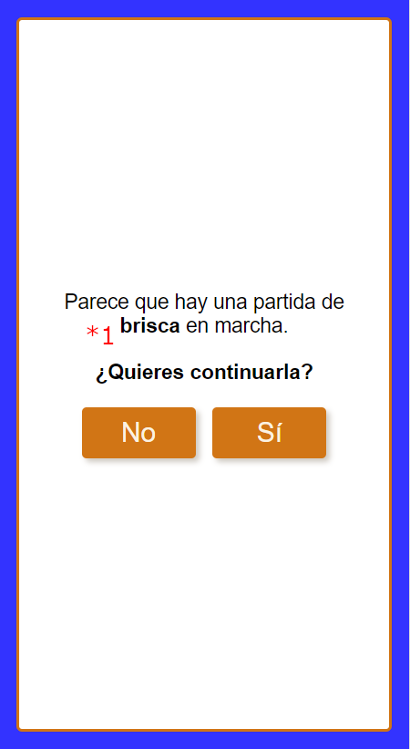

# Resume view

This view shows when there is a game in progress and there is a page refresh (detected in the [appGuard](../src/app/app.guard.ts)).

Allows to continue the game where it was left, with same configuration, players, scores...

## Flags

### (*1) resumeGame:gameName

If active, shows the game name that is in progress.

**Properties**:

- gameName: string

### (*2) game:localStorageSave

If active, loads the state of the game from local storage when the user presses the _'yes'_ button.

**Properties**:

- loadStateFromLocalStorage(): void

## In GameService interface

**Properties**:

- startGameRoute: RoutingPath

## Functional description

When the user presses the _'No'_ button, they are redirected to [game config](./GAME_CONFIG.md) view to start a new game (no edition mode).

When the user presses the _'Yes'_ button, the state of the game service is optionally restored from local storage and then the user is redirected to _startGameRoute_.
