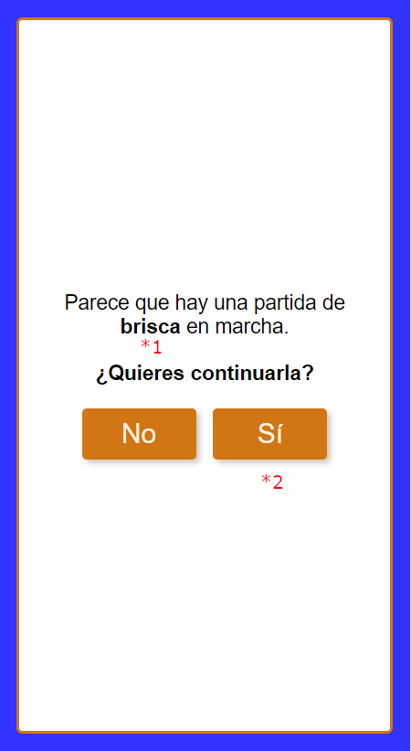

# Resume view

## Flags

### (*1) resumeGame:gameName

Shows the game name that is in progress.

**Properties**:

- gameName: string

## In GameService interface

**Properties**:

- loadStateFromLocalStorage(): void

- startGameRoute: RoutingPath
