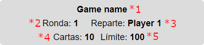

# Round info component

## Flags

### (*1) roundInfo:gameName

Allows to show the game name.

**Properties**:

- gameName: string

### (*4) roundInfo:numberOfCards

Allows to display the number of cards to deal in next round.

**Properties**:

- getNumberOfCardsToDealNextRound: () => string

### (*5) roundInfo:limitScore

Allows to display the limit score of the game.

**Properties**:

- limitScore: number

## In GameService interface

### (*2) Round number

Displays the round number.

**Properties**:

- getNextRoundNumber(): number

### (*3) Player name that deals

Displays the player name that deals in next round.

**Properties**:

- getPlayerNameThatDeals(): string

### (*6) End game

If true, hides all the other information (except game name if available) and shows that the game is finished.

**Properties**:

- gameHasFinished(): boolean
