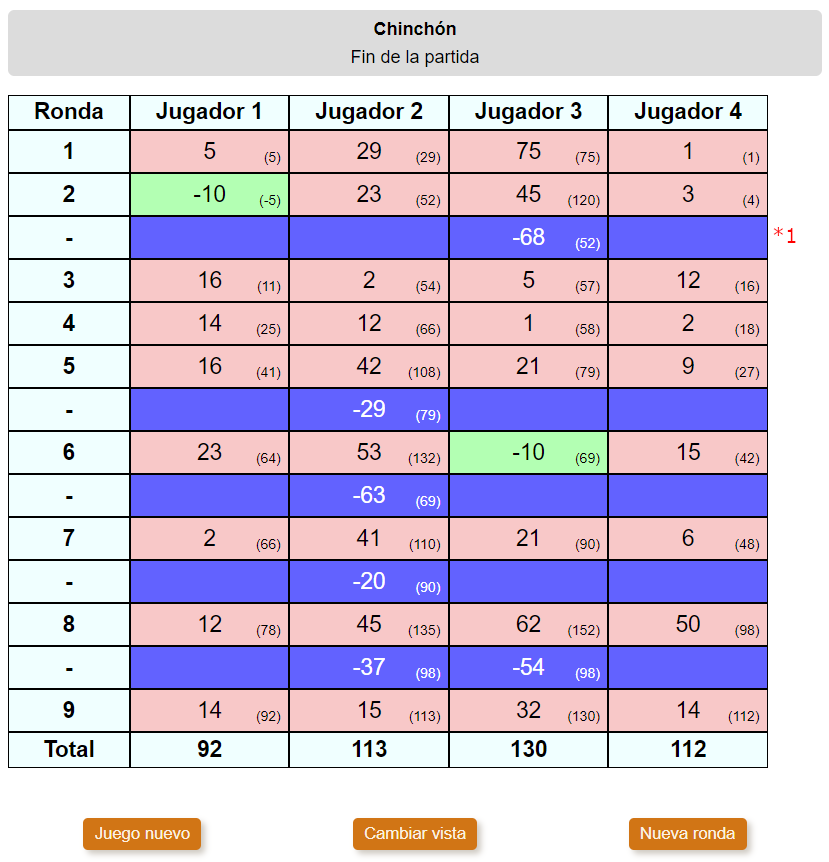

# Scoreboard view

Shows a table with all the scores of all players in all rounds, and allows to change them.

**(\*4)** When clicking the round number, it is possible to change the scores of all players for that round.

**(\*5)** When clicking the score of one player, it is possible to change the score of that player at that round.

**(\*6)** This is a special round calculated by the game.

## Flags

### scoreboard

Allows to show the scoreboard view and change the scores.

**Properties**:

- **(\*4) (\*5)** enterScoreRoute: RoutingPath
- **(\*1)** playerNames: string[]
- **(\*2)** getPlayerScore: (playerId: number, round?: number) => number
- **(\*3)** **(\*9)** getTotalScore: (playerId: number, round?: number) => number
- **(\*5)** getCellBackgroundColor: (score: number) => string

### scoreboard:specialRounds

Allows to show special rows in the table.

**Properties**:

- **(\*6)** showSpecialRowAfterRound: (round: number) => boolean
- **(\*7)** getSpecialRoundScores: (round: number) => number[]
- **(\*8)** getPlayerAccumulatedScoreAtSpecialRound: (playerId: number, round: number) => number

### gameStartEnd

Allows to show a message before the scoreboard can be shown.

**Properties**:

- gameHasStarted: () => boolean

### game:rounds

**Properties**:

- getNextRoundNumber: () => number
