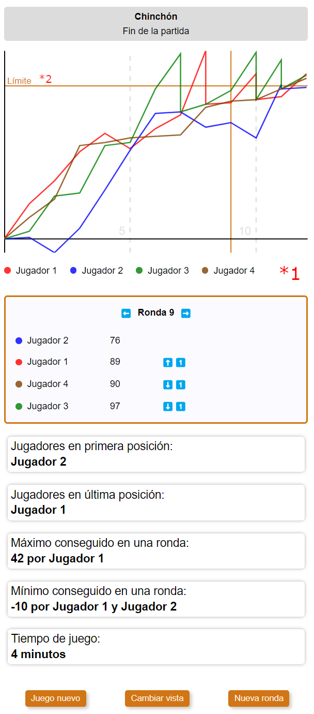

# Statistics view

## Flags

### statistics

Allows to show the screen with statistics about the game.

**Properties**:

- showProgressGraph: boolean
- getPlayersInFirstPosition: () => string
- getPlayersInLastPosition: () => string
- getMaximumScoreInOneRound: () => number
- getPlayerNamesWithMaximumScoreInOneRound: () => string
- getMinimumScoreInOneRound: () => number
- getPlayerNamesWithMinimumScoreInOneRound: () => string

### (*1) statistics:progressGraph

Allows to show the graph and the panel with info for a round

**Properties**:

- svgWidth: number
- svgHeight: number
- svgXAxisHeight: number
- getSvgPlayerLine: (player: Player) => string
- getTotalScore: (playerId: number, round: number) => number
- getRankingPlayers(round: number): Player[]
- getPlayerPosition(playerId: number, round: number): number

### (*2) statistics:progressGraph:limitScore

Shows the limit score line in the progress graph

**Properties**:

- svgLimitScoreHeight: number

## In GameService interface

**Properties**:

- gameHasStarted(): boolean

- get players(): Player[]

- getNextRoundNumber(): number
