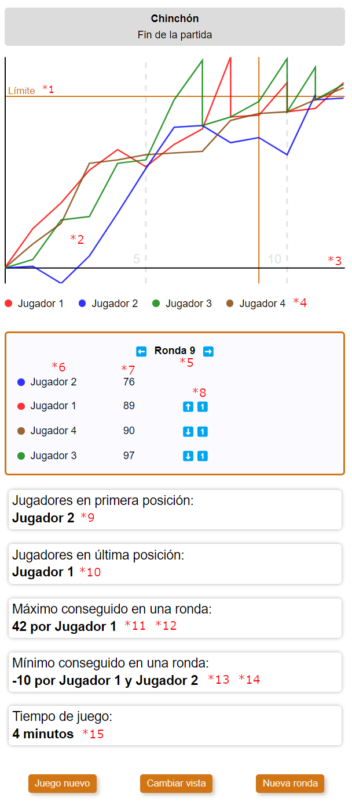

# Statistics view

This view shows statistics about the game.

## Flags

### statistics

Allows to show the screen with statistics about the game.

**Properties**:

- **(\*9)** getPlayersInFirstPosition: () => string;
- **(\*10)** getPlayersInLastPosition: () => string;
- **(\*11)** getMaximumScoreInOneRound: () => number;
- **(\*12)** getPlayerNamesWithMaximumScoreInOneRound: () => string;
- **(\*13)** getMinimumScoreInOneRound: () => number;
- **(\*14)** getPlayerNamesWithMinimumScoreInOneRound: () => string;

### gameStartEnd

Allows to show a message before the ranking of players can be listed.

**Properties**:

- gameHasStarted: () => boolean

### statistics:progressGraph

If active, shows the graph and the panel with info for a round.

**Properties**:

- svgWidth: number
- svgHeight: number
- **(\*2)** getSvgPlayerLine: (player: Player) => string
- **(\*3)** svgXAxisHeight: number
- **(\*4)** playerNames: string[]
- **(\*5)** getNextRoundNumber: () => number
- **(\*6)** getRankingPlayers(round: number): Player[]
- **(\*6)** getPlayerName: (playerId: number) => string
- **(\*7)** getTotalScore: (playerId: number, round: number) => number
- **(\*8)** getPlayerPosition(playerId: number, round: number): number

### statistics:progressGraph:limitScore

If active, shows the limit score line in the progress graph.

**Properties**:

- **(\*1)** svgLimitScoreHeight: number

## Functional analysis

The time the game lasts **(\*15)** is calculated on page load, and it is the difference of time since the time started in [game config view](./GAME_CONFIG.md) and now.
